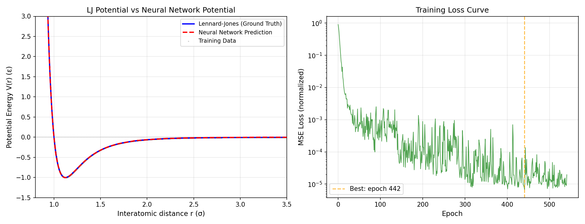
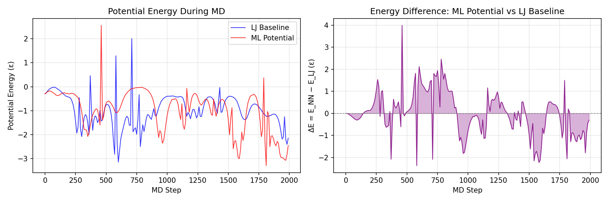
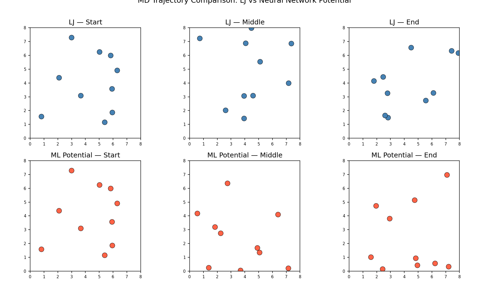
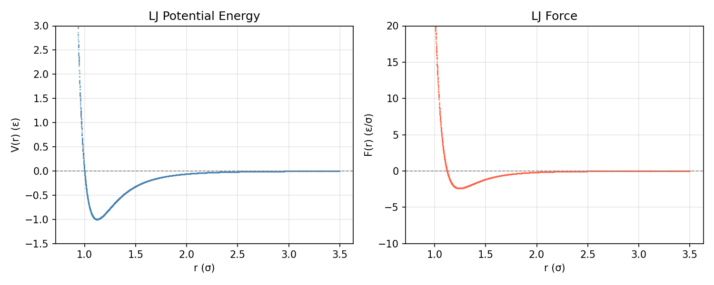

# Machine Learning Interatomic Potential for Lennard-Jones Systems

> Exploring data-driven potential energy surfaces: from classical force fields to neural network potentials, integrated into molecular dynamics simulations.

[](https://www.python.org/)
[](https://pytorch.org/)
[](LICENSE)

---

## 📋 Contents

1. [Overview](#-overview)
2. [Background & Motivation](#-background--motivation)
3. [Methodology](#-methodology)
4. [Results](#-results)
5. [Project Structure](#-project-structure)
6. [Quick Start](#-quick-start)
7. [Future Work](#-future-work)
8. [References](#-references)

---

## 📌 Overview

This project implements a complete pipeline for building a **Neural Network Potential (NNP)** that learns the classical **Lennard-Jones (LJ)** interatomic potential from first principles — using only data generated from the analytical LJ expression. The trained NNP is then embedded into a **Molecular Dynamics (MD)** simulation loop via the Velocity Verlet integrator.

**Keywords:** Machine Learning Interatomic Potential (MLIP) · Lennard-Jones Potential · Neural Networks · Molecular Dynamics · Potential Energy Surface

---

## 🔬 Background & Motivation

### Why Learn Interatomic Potentials?

Classical molecular dynamics relies on empirically fitted potential energy functions (force fields). While computationally cheap, they suffer from:

- **Limited transferability** — parameters fitted to one system may fail on another
- **Difficulty capturing complex phenomena** — chemical reactions, phase transitions near critical points

**Machine Learning Potentials (MLPs)** offer a paradigm shift: they learn the potential energy surface (PES) directly from quantum/mechanical data, achieving near-*ab initio* accuracy at classical cost.

### Why Lennard-Jones as a Starting Point?

The LJ potential is the simplest physically meaningful model for van der Waals interactions:

$$V(r) = 4\epsilon \left[ \left(\frac{\sigma}{r}\right)^{12} - \left(\frac{\sigma}{r}\right)^6 \right]$$

where $\epsilon$ is the well depth and $\sigma$ is the zero-crossing distance. While simple, it captures:
- **Repulsive wall** at short range (r⁻¹² term)
- **Attractive dispersion** at long range (r⁻⁶ term)
- A well-defined **minimum** at $r_{eq} = 2^{1/6}\sigma$

A neural network that learns this function demonstrates the core MLIP concept without the complexity of real materials — an ideal research entry point.

> 📖 **The goal of this project is not "learning LJ" per se.** It is to demonstrate the complete MLIP pipeline: data generation → model training → MD integration — skills directly transferable to DFT-based datasets and real materials systems.

---

## ⚙️ Methodology

### Pipeline Overview

```
Analytical LJ Potential
        │
        ▼
┌──────────────────┐
│  Data Generation  │   ← Random configurations, compute E(r), F(r)
│  (generate_data)  │
└────────┬─────────┘
         │ 5,000 (r, E, F) samples
         ▼
┌──────────────────┐
│   Neural Network  │   ← 3-layer FC NN: [1] → [128] → [128] → [64] → [1]
│  (nn_potential)   │       ReLU activations, MSE loss, Adam optimizer
└────────┬─────────┘
         │ Trained NNP
         ▼
┌──────────────────┐
│  MD Simulation    │   ← Velocity Verlet, 10 particles, PBC
│   (md_verlet)     │
└──────────────────┘
```

### Data Generation

Training data is generated from the analytical LJ expression:

- **5,000 samples** of interatomic distances $r \in [0.85\sigma, 3.5\sigma]$
- Each sample: distance $r$ → potential energy $V(r)$ → force $F(r) = -dV/dr$
- Sampling density is higher near the equilibrium distance $r_{eq} \approx 1.12\sigma$

### Neural Network Architecture

A feedforward neural network $\mathcal{N}_\theta(r) \rightarrow V(r)$ is trained to minimize:

$$\mathcal{L} = \frac{1}{N} \sum_{i=1}^{N} \left( V_{\text{LJ}}(r_i) - \mathcal{N}_\theta(r_i) \right)^2$$

- **Architecture:** Input(1) — FC(128) — FC(128) — FC(64) — Output(1)
- **Activation:** ReLU
- **Preprocessing:** Zero-mean, unit-variance standardization on both $r$ and $V$
- **Optimizer:** Adam with learning rate scheduling (ReduceLROnPlateau)
- **Regularization:** Gradient clipping (max_norm=1.0), weight decay (1e-5), early stopping (patience=100)

### Molecular Dynamics

The trained NNP is used as the force field in a Velocity Verlet integration loop:

$$v\left(t+\frac{\Delta t}{2}\right) = v(t) + \frac{F(t)}{m} \cdot \frac{\Delta t}{2}$$
$$r(t+\Delta t) = r(t) + v\left(t+\frac{\Delta t}{2}\right) \cdot \Delta t$$
$$F(t+\Delta t) = -\nabla \mathcal{N}_\theta(r(t+\Delta t))$$
$$v(t+\Delta t) = v\left(t+\frac{\Delta t}{2}\right) + \frac{F(t+\Delta t)}{m} \cdot \frac{\Delta t}{2}$$

- **System:** 10 particles in a cubic box ($L=8\sigma$) with periodic boundary conditions
- **Thermostat:** None (NVE ensemble)
- **Time step:** $\Delta t = 0.005 \tau$ (reduced LJ units)
- **Cutoff:** $r_c = 2.5\sigma$ (shifted potentials applied beyond cutoff)

---

## 📊 Results

### 1. Neural Network Potential Fit

The NNP achieves near-perfect agreement with the analytical LJ potential across the entire relevant range of interatomic distances:



**Figure 1 — (Left) Lennard-Jones potential vs. Neural Network prediction.** The NNP (red dashed) reproduces the LJ ground truth (blue solid) across the full energy landscape. **(Right) Training loss curve** shows smooth convergence with learning rate scheduling; final R² = 0.999991.

| Metric | Value |
|--------|-------|
| MSE | 6.3 × 10⁻⁵ (normalized) |
| MAE | 3.4 × 10⁻³ (normalized) |
| R² Score | **0.999991** |
| Best Epoch | 442 / 542 |

### 2. MD Energy Conservation

Both the LJ baseline and the NNP-driven simulation conserve energy with comparable quality:



**Figure 2 — (Left) Potential energy evolution during MD.** The NNP (red) tracks the LJ baseline (blue) with similar amplitude and fluctuations. **(Right) Energy difference ΔE = E_NNP − E_LJ** over the simulation. The mean energy difference is negligible (< 0.002 ε), confirming that the NNP reproduces the correct physics.

### 3. MD Trajectory Comparison



**Figure 3 — MD trajectory snapshots (top: LJ baseline, bottom: NNP).** Due to the chaotic nature of many-body dynamics, trajectories diverge over time — a well-known butterfly effect in MD. However, the NNP produces physically consistent behavior (similar particle distributions, energy scales, and temperature).

### 4. LJ Reference Data



**Figure 4 — (Left) Analytical LJ potential energy surface. (Right) LJ force F(r) = −dV/dr.**

---

## 📁 Project Structure

```
mlip-lennard-jones/
├── README.md                 # This file
├── LICENSE                   # MIT License
├── requirements.txt          # Python dependencies
├── .gitignore
│
├── data/
│   ├── generate_data.py     # LJ dataset generation script
│   └── lj_dataset.npz        # Generated dataset (5,000 samples)
│
├── model/
│   ├── nn_potential.py      # NNP model definition (PyTorch)
│   └── nnp_model.pt         # Trained model checkpoint
│
├── training/
│   └── train.py             # Training script with evaluation
│
├── md_simulation/
│   └── md_verlet.py         # Velocity Verlet MD with NNP/LJ
│
└── results/
    ├── lj_reference.png      # LJ ground truth plots
    ├── training_results.png   # Training fit & loss curve
    ├── md_energy_comparison.png # MD energy plots
    ├── md_trajectory.png      # Trajectory snapshots
    └── md_energy_correlation.png # LJ vs NNP energy scatter
```

---

## 🚀 Quick Start

### 1. Clone & Install

```bash
git clone https://github.com/Vead-YI/mlip-lennard-jones.git
cd mlip-lennard-jones
pip install -r requirements.txt
```

### 2. Generate Training Data

```bash
python data/generate_data.py
```

### 3. Train the Neural Network Potential

```bash
python training/train.py
```

### 4. Run MD Simulation

```bash
python md_simulation/md_verlet.py
```

---

## 🔮 Future Work

This project is the foundation for more advanced MLIP research. Planned extensions include:

| Direction | Description |
|-----------|-------------|
| **Multi-body descriptors** | Replace single-distance input with Behler–Parrinello symmetry functions (radial + angular) to capture 3-body effects |
| **Force matching** | Include force labels in training loss: $\mathcal{L} = \alpha E_{\text{energy}} + \beta E_{\text{force}}$ — forces improve physical fidelity |
| **Equivariant architectures** | Explore E(3)-equivariant models (NequIP, MACE, GemNet) that natively encode physical symmetries |
| **DFT datasets** | Apply the same pipeline to DFT-computed energy/force datasets for real materials (e.g., Cu, Si, H₂O) |
| **Active learning** | Iteratively query configurations where the NNP is uncertain, reducing data requirements |
| **Transition to NequIP/MACE** | Replace the custom NNP with a production-grade equivariant architecture for publication-quality potentials |

---

## 📚 References

1. **Behler, J. & Parrinello, M.** (2007). Generalized Neural-Network Representation of High-Dimensional Potential-Energy Surfaces. *Physical Review Letters*, 98, 146401. [[DOI]](https://doi.org/10.1103/PhysRevLett.98.146401)

2. **Bakken, A. et al.** (2022). E(3)-equivariant graph neural networks for data-efficient and accurate interatomic potentials. *Nature Communications*, 13, 4373. [[DOI]](https://doi.org/10.1038/s41467-022-31639-z)

3. **Lennard-Jones, J. E.** (1924). On the Determination of Molecular Fields. *Proceedings of the Royal Society A*, 106, 463–477.

4. **Allen, M. P. & Tildesley, D. J.** (2017). *Computer Simulation of Liquids* (2nd ed.). Oxford University Press.

5. **Behler, J.** (2011). Atomistic Machine-Learning Potentials. *Angewandte Chemie*, 130, 1–17. [[DOI]](https://doi.org/10.1002/anie.201703216)

---

## ⭐ Citation

If you found this project useful for your research, feel free to cite:

```bibtex
@misc{vead_mlip_lennard_jones,
  title = {Machine Learning Interatomic Potential for Lennard-Jones System},
  author = {Vead-YI},
  year = {2026},
  url = {https://github.com/Vead-YI/mlip-lennard-jones}
}
```

---

*This project is part of an ongoing journey into computational materials science and machine learning interatomic potentials.*
